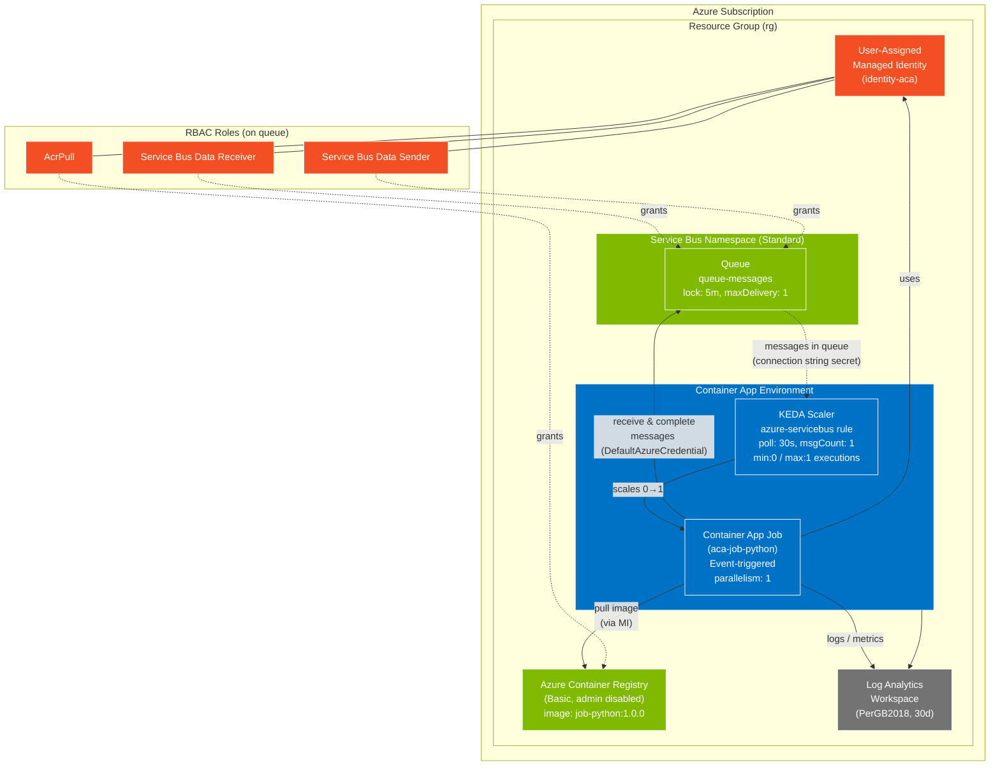

# Architecture — KEDA Service Bus Event-Triggered Job

This demo provisions a Container App **Job** that is triggered by messages on an Azure
Service Bus queue using a KEDA `azure-servicebus` scale rule.

## How it works

1. **Trigger** — Messages land in the Service Bus `queue-messages`. The Container App
   Job's KEDA `azure-servicebus` scale rule polls the queue every 30s using a
   connection-string secret.
2. **Scale to job** — When `messageCount >= 1`, KEDA starts a job execution
   (scales `0 -> 1`, max 1 parallel replica).
3. **Process** — The Python container (`processor.py`) pulls its image from ACR (via the
   user-assigned managed identity / `AcrPull`), connects to Service Bus with
   `DefaultAzureCredential`, receives one message, and completes it.
4. **Auth** — The user-assigned managed identity holds **Service Bus Data
   Receiver/Sender** on the queue and **AcrPull** on the registry, so no secrets are
   needed at container runtime. The KEDA scaler itself still uses the namespace
   connection-string secret for polling.
5. **Observability** — The Container App Environment streams logs/metrics to the
   Log Analytics workspace.
